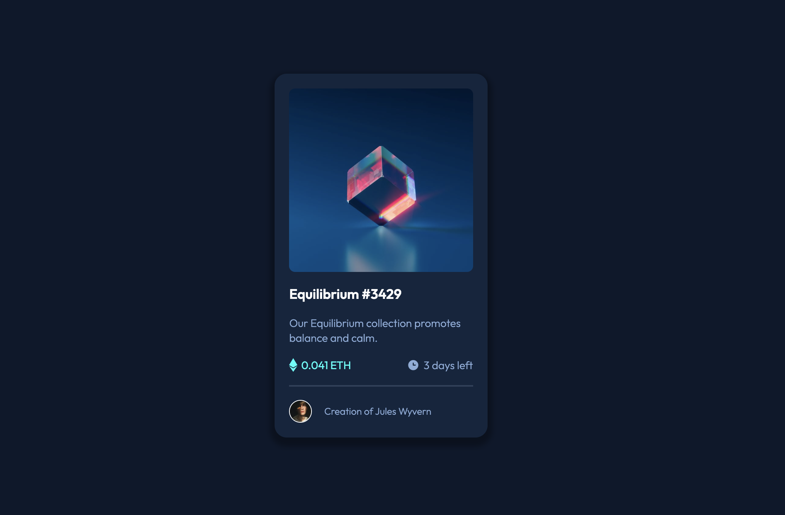
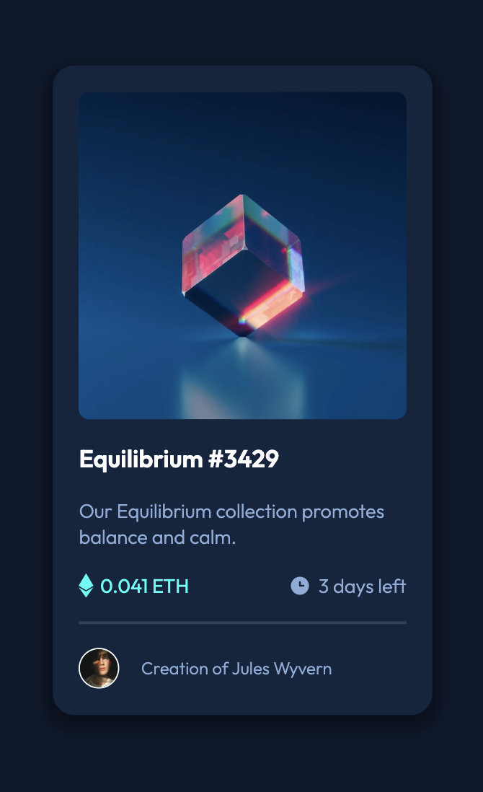
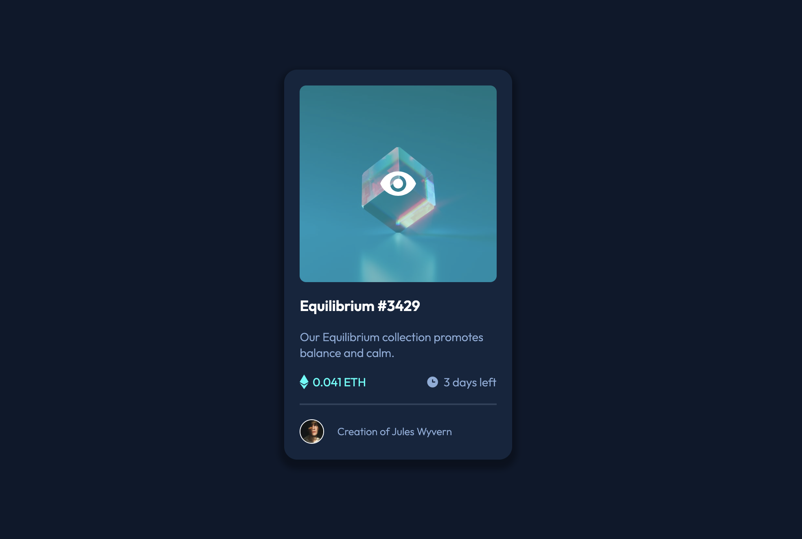
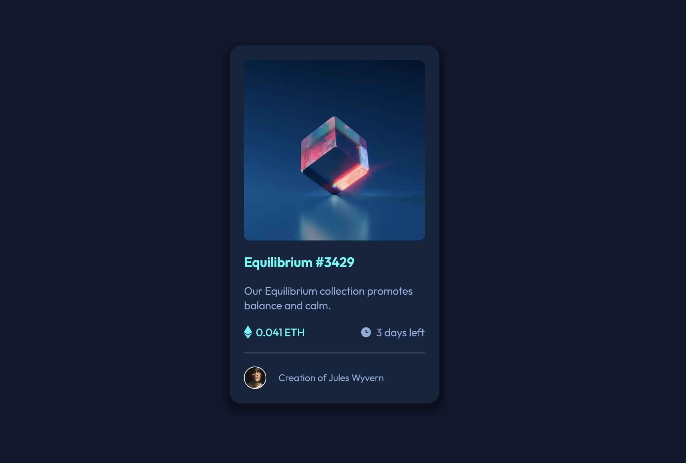
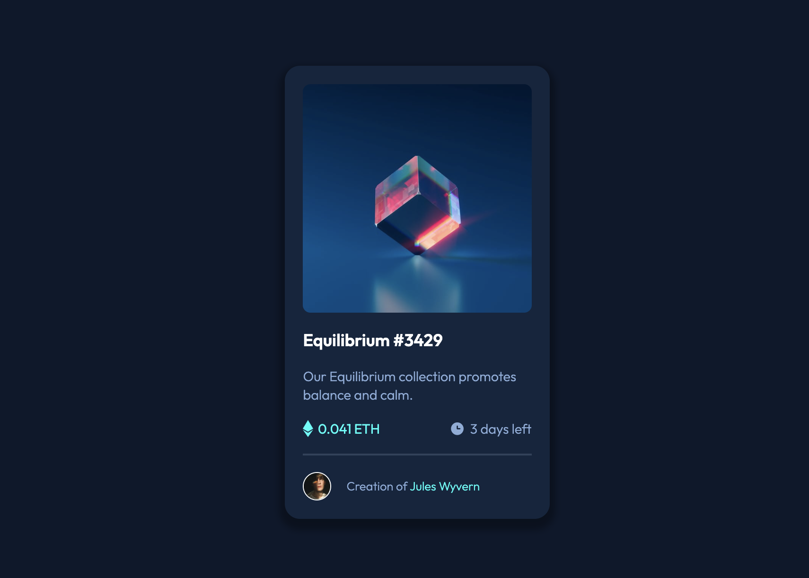

# Frontend Mentor - NFT preview card component solution

This is a solution to the [NFT preview card component challenge on Frontend Mentor](https://www.frontendmentor.io/challenges/nft-preview-card-component-SbdUL_w0U). Frontend Mentor challenges help you improve your coding skills by building realistic projects. 

## Table of contents

- [Overview](#overview)
  - [The challenge](#the-challenge)
  - [Screenshot](#screenshot)
  - [Links](#links)
- [My process](#my-process)
  - [Built with](#built-with)
  - [What I learned](#what-i-learned)

## Overview

### The challenge

Users should be able to:

- View the optimal layout depending on their device's screen size
- See hover states for interactive elements

### Screenshot

### Links

- Solution URL: [Add solution URL here](https://your-solution-url.com)
- Live Site URL: [Add live site URL here](https://your-live-site-url.com)

## My process

### Built with

- Semantic HTML5 markup
- CSS custom properties
- Flexbox

### What I learned
In course of completing this challenge I learned how to design an overlay to create an active hover state when scrolling on an image. To avoid having to change the image in any way, you can put an overlay ontop of an image. I used a div containing the view svg to have an overlay on the equilibrium image. This div has the secondary colour as its background and the view svg as an image placed in the center of it using Flexbox. I also learned about how to use css transitions when designing the overlay. CSS transitions allow you to change properties over a given time of an element. I will continue to learn more about the posible uses of CSS transitions.

